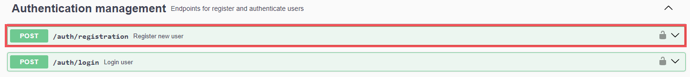
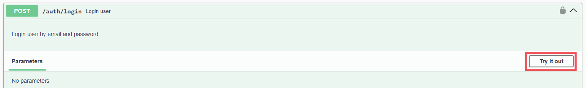
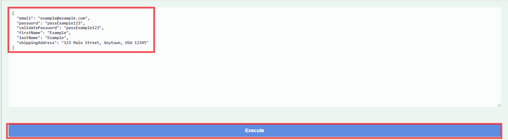
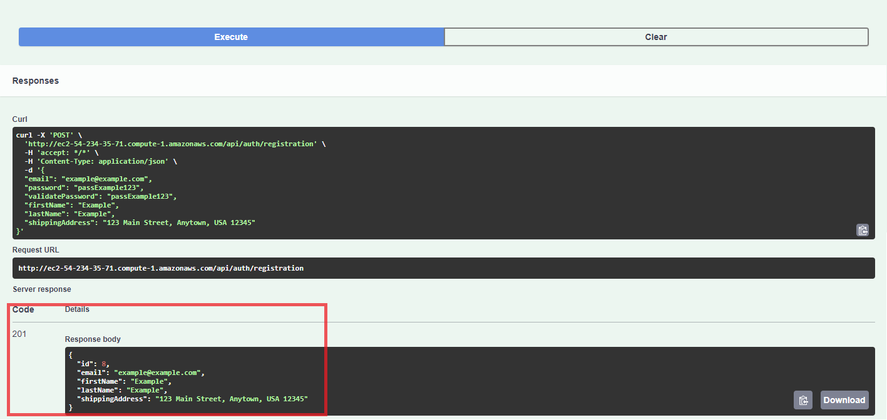
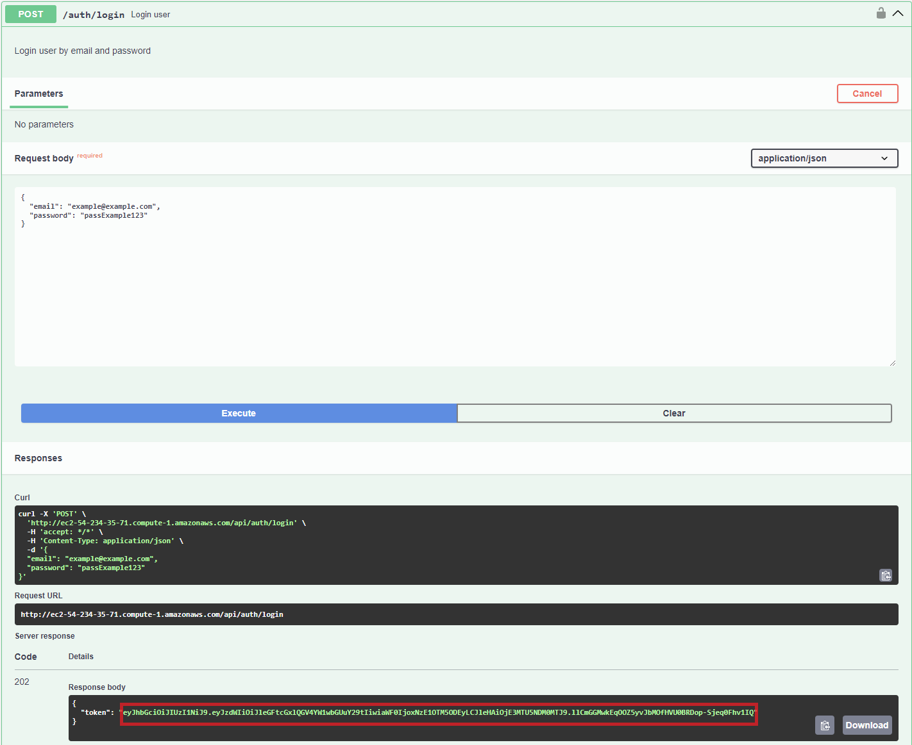
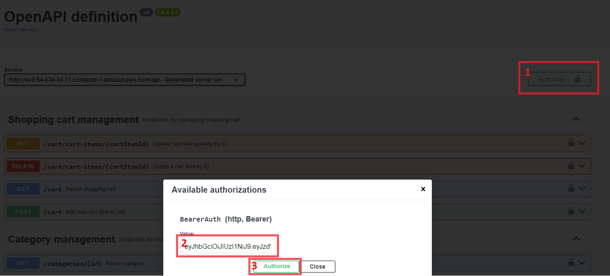

***
<p>
  <a href="https://github.com/k0sm0naft/java-online-book-store" target="_blank">
    
  </a>
  <a href="https://github.com/k0sm0naft/java-online-book-store" target="_blank">
    
  </a>
</p>
<h1 align="center"> 📚 Welcome to Book Nook App</h1>
<div align="center">
  
</div>

> In the digital age, online bookstores have revolutionized how we buy and sell books, offering unparalleled convenience and accessibility. **Book Nook App** was inspired by the need for a seamless, user-friendly backend platform where book lovers can discover, purchase, and manage their favorite reads.
>
> **Book Nook App** addresses key challenges:
> - **For Customers**: Simplifies finding the right book with robust search and filter options, ensuring a smooth purchasing experience through an efficient order management system.
> - **For Administrators**: Provides comprehensive tools for inventory management, order tracking, and real-time updates, making it easy to manage an online bookstore.
> 
> Built with Spring Boot, Spring Security, Spring Data JPA, and Springdoc OpenAPI, **Book Nook App** offers a secure and robust backend, perfect for supporting the operations of an online bookstore.

***

## 📜 Table of Contents

- [▶Demo](#Demo)
- [▶Technologies Used](#Technologies-Used)
- [▶Features](#Features)
    - [▶Swagger Documentation](#Swagger-Documentation)
    - [▶Authentication](#Authentication)
    - [▶Book](#Book)
    - [▶Category](#Category)
    - [▶Shopping Cart](#Shopping-Cart)
    - [▶Order](#Order)
- [Short Overview](#Short-Overview)
- [▶Setup Instructions](#Setup-Instructions)
    - [▶Required](#Required)
    - [▶Installation](#Installation)
    - [▶Running Tests](#Running-Tests)
- [▶Postman Collection](#Postman-Collection)
- [▶Challenges Faced](#Challenges-Faced)
- [▶Author](#Author)
- [▶License](#License)

***

## ✨[Demo](http://ec2-54-234-35-71.compute-1.amazonaws.com/api/swagger-ui/index.html)

<details><summary>How to use demo:</summary>

####
<details><summary>Use Swagger UI</summary>

1. Open Authentication management Registration endpoint:

   

2. Click on "Try it out" button:

   

3. Register a new user (fill in a unique email) and "Execute":

   

4. If you successfully registered, you'll see status code 201 with your registration data:

   

5. Repeat steps 1-3 on Authentication management Login endpoint (use registered login and password).

6. Copy token from response body:

   

7. Click on the "Authorize" button on the top of the page, paste the token in the field, and click "Authorize":

   

8. Now you can use [endpoints for users](#Authentication).

</details>

[Use Postman collection](#Postman-Collection)

If you want to use manager's endpoints, fill free to use credentials below:
```javascript
{
    "email":"manager@example.com",
    "password":"12345678"
}
```

Note: The token expires after 1 hour, so you must log in again.

</details>

***

## 🛠️Technologies Used

- **Spring Boot**: Framework for building Java-based web applications.
- **Spring Security**: Provides authentication and authorization.
- **Spring Data JPA**: Simplifies database interactions.
- **Spring Web**: For building web-based applications with Spring MVC.
- **Springdoc OpenAPI**: Generates API documentation.
- **MySQL**: Database management system.
- **Hibernate**: As the ORM tool.
- **Liquibase**: Database migration tool.
- **MapStruct**: Object mapping framework.
- **JUnit**: Testing framework.
- **Mockito**: Mocking framework for tests.
- **Maven**: For project management and dependency management.
- **Testcontainers**: Provides lightweight, throwaway instances of databases, selenium web servers, or anything else that can run in a Docker container.
- **Docker**: Containerization platform.

***

## 🌎Features

### 📝Swagger Documentation
Swagger is integrated into the project to provide comprehensive API documentation and facilitate testing of endpoints. With Swagger, you can visualize and interact with the API's resources without having any of the implementation logic in place.

To access the Swagger UI and explore the API documentation:

Once the application is running, navigate to `http://localhost:8080/api/swagger-ui/index.html` in your web browser.

You will see the Swagger UI interface, where you can view all available endpoints, their descriptions, request parameters, and response schemas.

Use the interactive features of Swagger UI to make requests directly from the browser and observe the responses.

### 🔑Authentication

<details><summary>Authentication Endpoints: Users can register and log in.</summary>
 
  - **Register a new user** 
    - Request: `POST /api/auth/register`
    - Response: `201 Created`
  - **Login a user**
    - Request: `POST /api/auth/login`
    - Response: `200 OK` with JWT token

</details>


### 📗Book

<details>
  <summary>User's Endpoints: View and search books.</summary>

  - **Get all books**
    - Request: `GET /api/books`
    - Response: `200 OK`
  - **Get a book by ID**
    - Request: `GET /api/books/{id}`
    - Response: `200 OK`
  - **Search books by params**
    - Request `GET /api/books/search`
    - Response: `200 OK`

</details>

<details>
  <summary>Manager's and Admin's Endpoints: Add, update, and delete books.</summary>

  - **Add a new book**
    - Request `POST /api/books`
    - Response: `201 Created`
  - **Update a book**
    - Request `PUT /api/books/{id}`
    - Response: `202 Accepted`
  - **Delete a book**
    - Request `DELETE /api/books/{id}`
    - Response: `204 No Content`

</details>

### 📑Category

<details>
  <summary>User's Endpoints: View categories.</summary>

  - **Get all categories**
    - Request `GET /api/categories`
    - Response: `200 OK`
  - **Get a category by ID**
    - Request `GET /api/categories/{id}`
    - Response: `200 OK`
  - **Get all books from category**
    - Request `GET /api/categories/{id}/books`
    - Response: `200 OK`

</details>

<details>
  <summary>Manager's and Admin's Endpoints: Create, update, and delete book categories.</summary>

  - **Add a new category**
    - Request `POST /api/categories`
    - Response: `201 Created`
  - **Update a category**
    - Request `PUT /api/categories/{id}`
    - Response: `202 Accepted`
  - **Delete a category**
    - Request `DELETE /api/categories/{id}`
    - Response: `204 No Content`

</details>

### 🛒Shopping Cart

<details>
  <summary>User's Endpoints: Add books to the cart, view cart items, update and remove items from the cart.</summary>

  - **Get current user's shopping cart**
     - Request `GET /api/cart`
     - Response: `200 Ok`
  - **Add a book to the cart**
     - Request `POST /api/cart`
     - Response: `201 Created`
  - **Update book quantity**
     - Request `PUT /api/cart/cart-items/{cartItemId}`
     - Response: `202 Accepted`
  - **Remove a book from the cart**
     - Request `DELETE /api/cart/cart-items/{cartItemId}`
     - Response: `204 No Content`

</details>

### 🛍️Order

<details>
  <summary>User's Endpoints: Complete the purchase, view past orders and their details.</summary>

- **Create order**
       - Request `POST /api/orders`
       - Response: `201 Created`
    - **Get all orders for current user**
       - Request `GET /api/orders`
       - Response: `200 Ok`
    - **Get an order details by ID**
     - Request `GET /api/orders/{orderId}/items`
     - Response: `200 Ok`
  - **Get an ordered book details by ID**
       - Request `GET /api/orders/{orderId}/items/{id}`
        - Response: `200 Ok`

</details>

<details>
  <summary>Manager's and Admin's Order Endpoints: Update order statuses.</summary>

- **Update order status**
       - Request `PATCH /api/orders/{id}`
       - Response: `202 Accepted`

</details>

***

## 📺Short Overview

<a href="https://www.loom.com/share/0e9df6c8dab44ffcbb104629e2afa5ce">
  
</a>

***

## 🚀Setup Instructions

### 🧰Required

- **Java 21+**
- **Maven 3+**
- **MySQL 8+**
- **Docker**
- **Docker Compose**

### 🏗️Installation

1. **Clone the Repository**:
   ```bash
   git clone https://github.com/k0sm0naft/java-online-book-store.git
   cd java-online-book-store
    ```

2. **Set Environment Variables**:

   Create a `.env` file in the project root directory and populate it with the following environment variables:
   ```env
   MYSQLDB_USER=your_db_user_name
   MYSQLDB_ROOT_PASSWORD=your_db_password
   JWT_SECRET=yourVeryLongSecretStringForJwtSecretKey
   JWT_EXPIRATION=3600000
   
   MYSQLDB_DATABASE=your_db_name
   MYSQLDB_LOCAL_PORT=3306
   MYSQLDB_DOCKER_PORT=3306
   
   SPRING_LOCAL_PORT=8080
   SPRING_DOCKER_PORT=8080
   DEBUG_PORT=5005
   ```
   
3. **Install dependencies and build the project:**

    ```bash
    mvn clean install
    ```

4. **Build and Run the Docker Containers**:
   ```bash
   docker-compose up
   ```

5. **Access the Application**:

   Open your browser and go to http://localhost:8080/api/swagger-ui.html to access the Swagger API documentation.


6. **Stop and Remove Containers**:
To stop and remove the containers created by the Compose file, use the docker-compose down command:

   ```bash
    docker-compose down
    ```

### 🧪Running Tests

- To run tests, use the following command:
    ```bash
    mvn test
    ```

- Testing with JUnit and Mockito
- The project uses JUnit for unit testing and Mockito for mocking dependencies. This ensures that the application logic is tested in isolation, making the tests more reliable and easier to maintain.

***

## 📬Postman Collection

To facilitate testing, a Postman collection has been provided. You can import it into Postman and use it to test the local API endpoints.

[](https://www.postman.com/avionics-cosmonaut-92857509/workspace/book-store-api/overview)


Or fork and use remote URL:
- After you fork collection, you can register a new user, or use saved users.
- After log in, the generated token will be automatically added to all next requests that required authentication.

<details><summary>User</summary>

```javascript
{
    "email": "example@example.com", 
    "password": "passExample123"
}
```
</details>

<details><summary>Manager</summary>

```javascript
{
    "email":"manager@example.com",
    "password":"12345678"
}
```
</details>


***

## 👊Challenges Faced

***Security***: Setting up robust authentication and authorization using Spring Security.

***Database Management***: Utilized Spring Data JPA and Hibernate for efficient database interactions and ORM capabilities.

***Database Migrations***: Implementing database migrations with Liquibase to ensure consistency across different environments.

***API Documentation***: Ensuring comprehensive API documentation with Springdoc OpenAPI.

***

## 👷Author

* LinkedIn: [Artem Akymenko](https://www.linkedin.com/in/artem-akymenko-4b143030a/)
* Github: [@k0sm0naft](https://github.com/k0sm0naft)

***

## 📝License

Copyright © 2024 [Artem Akymenko](https://github.com/k0sm0naft).<br/>
This project is [MIT](LICENSE.md) licensed.
***